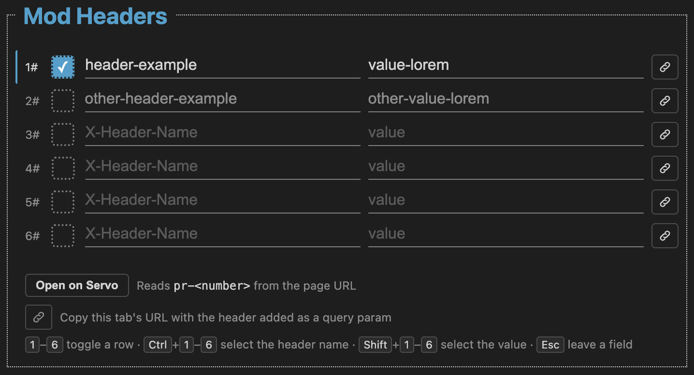

# FERHEADER

A small Chrome plugin I built to modify and add headers using only the keyboard, designed to speed up my workflow by automating repetitive tasks.

To install, download the project and add it manually to the plugins.

# Manual Chrome Extension Installation Guide

This guide walks you through manually installing a Chrome extension using a `.zip` file.

---

## 📋 Prerequisites

* A downloaded `.zip` file containing the Chrome extension.
* Google Chrome (or a Chromium-based browser like Brave, Edge, or Opera).

---

## 🛠️ Installation Steps

### Step 1: Extract the `.zip` File
Chrome cannot load an extension directly from a compressed zip archive; it requires an uncompressed folder.

1. Locate the downloaded `.zip` file on your computer.
2. Right-click the file and select **Extract All...** (Windows) or double-click it (macOS).
3. Choose a permanent location for the extracted folder (e.g., your `Documents` or a dedicated `Extensions` folder).

> ⚠️ **Important:** Do **not** delete or move this extracted folder after installation. Chrome links directly to this local directory. Moving or deleting the folder will break the extension.

---

### Step 2: Enable Developer Mode in Chrome
By default, Chrome blocks manually loaded extensions for security reasons. You must turn on Developer Mode to load unpacked files.

1. Open **Google Chrome**.
2. Navigate to `chrome://extensions/` by typing it into the address bar and pressing **Enter**.
   * *Alternative:* Click the **Three Dots Menu** (top-right) → **Extensions** → **Manage Extensions**.
3. In the top-right corner of the extensions page, toggle the **Developer mode** switch to **ON**.

---

### Step 3: Load the Unpacked Extension

1. Click the **Load unpacked** button that appears in the top-left corner.
2. File browser window will open. Navigate to the folder you extracted in **Step 1**.
3. Select the folder containing the extension files.
   * *Note:* Ensure you select the folder that directly contains the `manifest.json` file.
4. Click **Select Folder** (or **Open**).

---

### Step 4: Pin and Verify

1. Your extension should now appear in the list of installed extensions on the `chrome://extensions/` page.
2. To keep the extension easily accessible:
   * Click the **Puzzle Piece Icon** (Extensions) next to the Chrome address bar.
   * Find your newly installed extension and click the **Pin Icon** to pin it to your toolbar.

---

## 🔍 Troubleshooting

| Issue / Error | Likely Cause | Solution |
| :--- | :--- | :--- |
| **`Manifest file is missing or unreadable`** | You selected a outer/parent folder instead of the folder containing the source files. | Open the extracted folder and check inside. If there is a subfolder, select that inner folder when loading unpacked. |
| **Extension disappears after restarting Chrome** | The source folder was moved, renamed, or deleted from your local drive. | Re-extract the folder to a permanent location and repeat Step 3. |
| **Extension stops working or gets disabled** | Developer Mode was turned off. | Return to `chrome://extensions/` and ensure **Developer mode** is toggled ON. |

---

## 🔄 Updating & Removing

* **To Update:** Replace the existing files in your extracted folder with the updated files, then go to `chrome://extensions/` and click the **Reload** (circular arrow) icon on the extension's card.
* **To Uninstall:** Click the **Remove** button on the extension's card in `chrome://extensions/`. You can then safely delete the extracted folder from your computer.
